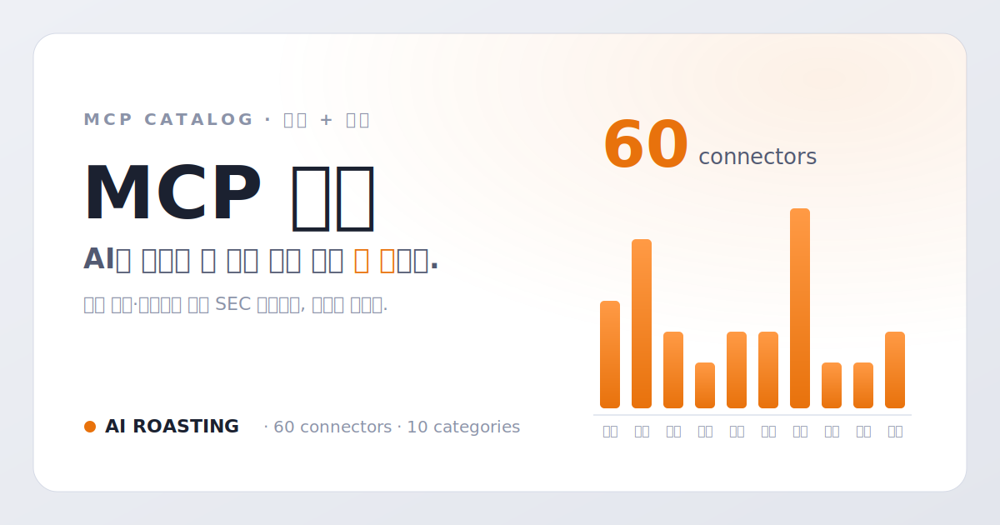

# MCP 허브 · AI ROASTING

AI에 연결할 수 있는 모든 것을 한 곳에서. 한국·미국 비즈니스 리더를 위한 오픈소스 **MCP 커넥터 카탈로그**.



## 무엇인가

MCP(Model Context Protocol)는 AI를 외부 데이터·서비스에 연결하는 표준 규격입니다. 이 사이트는 국내 공시·법령부터 미국 SEC 공시까지, 비즈니스 리더가 실제로 쓸 만한 커넥터를 검증해 카드로 모은 **단일 HTML 카탈로그**입니다. 카드를 누르면 각 오픈소스 GitHub 저장소로 이동합니다.

## 기능

- 커넥터·출처·제작자 통합 검색 (`/` 단축키), 자주 찾는 프리셋 토글
- 카테고리별 스펙트럼 미터(히어로) — 클릭하면 해당 섹션으로 이동
- 스타순 정렬, 인증 구분 LED(바로 사용 / 로그인만 / API 발급)
- 스티키 카테고리 바 + 스크롤스파이, 반응형(모바일~데스크톱)

## 카드 선정 기준

- **MCP 서버만 등재** — 스킬·모음집 제외, 이중 인터페이스는 허용
- **출처 직관성** — 배지를 보자마자 인지 못 하는 서비스는 제외
- **비즈니스 리더 대상** — 개발자 전용 도구 제외
- **같은 출처는 스타 최다 1개**
- **링크 유효성** — 404·비공개·아카이브 제외
- **MECE 분류** — 업무 도메인 단일 축 10개, 지역은 출처 배지로 표현
- **클로드 기본 커넥터 제외** — 이미 연결된 유명 SaaS는 넣지 않음
- **스타·포크는 GitHub API 실측값만** — 지어내지 않음

## 커넥터 60선 (카테고리별)

각 카드가 연결되는 오픈소스 저장소입니다. 스타순 정렬. `바로 사용` = 설치 즉시 / `로그인` = 서비스 계정 / `API` = 무료 키 발급.

### 법률·특허 (7)

- **인터넷등기소** · [iros-registry-automation](https://github.com/NomaDamas/k-skill/tree/main/iros-registry-automation) — 법인·부동산 등기부등본 열람 자동화 스킬 `로그인`
- **법원 전자소송** · [court-payment-order-assistant](https://github.com/NomaDamas/k-skill/tree/main/court-payment-order-assistant) — 지급명령 신청 정보 정리와 초안 작성 스킬 `로그인`
- **법제처** · [korean-law-mcp](https://github.com/chrisryugj/korean-law-mcp) — 법령·판례·행정규칙 검색·조회·분석 `API`
- **국회** · [assembly-api-mcp](https://github.com/hollobit/assembly-api-mcp) — 국회 의안·회의록·청원 등 276개 API 접근 `API`
- **특허청** · [korean-patent-mcp](https://github.com/chrisryugj/korean-patent-mcp) — 특허·실용신안·상표·디자인 검색 7개 도구 `API`
- **미국 의회** · [us-legal-mcp](https://github.com/JamesANZ/us-legal-mcp) — 미국 연방 법률·의회 법안 정보 조회 `API`
- **식약처·복지부** · [koregx](https://github.com/DrMoony/koregx) — 헬스케어 법령·행정해석·건강보험심사평가원 결정 통합 조회 `API`

### 금융·투자 (11)

- **토스증권** · [toss-securities](https://github.com/NomaDamas/k-skill/tree/main/toss-securities) — 계좌·주식 정보 조회 공식 Open API 스킬 `로그인`
- **팝빌** · [popbill](https://github.com/NomaDamas/k-skill/tree/main/popbill) — 전자세금계산서·현금영수증 등 업무 API 스킬 `API`
- **Yahoo Finance** · [yahoo-finance2](https://github.com/gadicc/yahoo-finance2) — 야후 파이낸스 시세·재무 데이터 조회 `바로 사용`
- **SEC EDGAR** · [sec-edgar-mcp](https://github.com/stefanoamorelli/sec-edgar-mcp) — 미국 증권거래위원회 전자공시에서 상장사 공시·재무 조회 `바로 사용`
- **QuickBooks** · [quickbooks-online-mcp](https://github.com/intuit/quickbooks-online-mcp-server) — 인튜이트 퀵북스 회계장부·인보이스·거래 조회 `API`
- **금융감독원·한국거래소** · [korea-stock-mcp](https://github.com/jjlabsio/korea-stock-mcp) — 금융감독원 전자공시와 한국거래소 시세로 한국 주식 분석 `API`
- **금융감독원** · [korean-dart-mcp](https://github.com/chrisryugj/korean-dart-mcp) — 금융감독원 전자공시·재무제표·지분 정보를 15개 도구로 조회 `API`
- **한국은행·국토부·금감원 외** · [korea-finance-mcp](https://github.com/emceeKim/korea-finance-mcp) — 거시지표·실거래가·공시·시세 통합 조회 `API`
- **포트원** · [portone-mcp-server](https://github.com/portone-io/mcp-server) — 결제·거래 내역 조회 공식 MCP 서버 `API`
- **한국투자증권** · [KIS_MCP_Server](https://github.com/migusdn/KIS_MCP_Server) — 국내외 주식 시세 조회와 주문 기능 `API`
- **금융감독원** · [dart](https://github.com/airoasting/dart) — 상장사 실적을 애널리스트급 HTML 리포트로 생성하는 스킬 `API`

### 경제·통계 (5)

- **공공데이터포털** · [data-go-mcp-servers](https://github.com/Koomook/data-go-mcp-servers) — 공공데이터포털 API를 패키지별 MCP 서버로 제공 `API`
- **미 연준 FRED** · [fred-mcp-server](https://github.com/stefanoamorelli/fred-mcp-server) — 미국 연방준비제도 경제지표·통계 조회 `API`
- **미국 정부** · [us-gov-open-data-mcp](https://github.com/lzinga/us-gov-open-data-mcp) — 미국 정부 데이터 API 40여 종, 250개 도구 `API`
- **미국 인구조사국** · [us-census-data-api-mcp](https://github.com/uscensusbureau/us-census-bureau-data-api-mcp) — 미국 인구·경제 센서스 통계 공식 서버 `API`
- **국가데이터처** · [korean-stats-mcp](https://github.com/chrisryugj/korean-stats-mcp) — 국가통계포털 시도·자치구 통계·시계열을 자연어로 조회 `API`

### 부동산 (3)

- **국토교통부** · [real-estate-mcp](https://github.com/tae0y/real-estate-mcp) — 부동산 매매·전월세·청약 정보 제공 `API`
- **국토교통부** · [archhub-mcp](https://github.com/chrisryugj/archhub-mcp) — 건축물대장·건축인허가·노후건축물 분석 `바로 사용`
- **Zillow** · [zillow-mcp-server](https://github.com/sap156/zillow-mcp-server) — 미국 부동산 시세·매물 데이터 조회 `API`

### 지도·교통 (5)

- **SRT** · [srt-booking](https://github.com/NomaDamas/k-skill/tree/main/srt-booking) — SRT 열차 조회·예약·예약 확인·취소 스킬 `로그인`
- **코레일** · [ktx-booking](https://github.com/NomaDamas/k-skill/tree/main/ktx-booking) — KTX 열차 조회·좌석 확인·예약·취소 스킬 `로그인`
- **하이패스** · [hipass-receipt](https://github.com/NomaDamas/k-skill/tree/main/hipass-receipt) — 하이패스 사용내역 조회와 영수증 발급 스킬 `로그인`
- **카카오** · [kakao-api-mcp-server](https://github.com/jeong-sik/kakao-api-mcp-server) — 카카오맵 장소 검색·좌표 변환·길찾기 `API`
- **네이버 클라우드** · [mcp-naver-map](https://github.com/yeonupark/mcp-naver-map) — IP 기반 위치 조회와 드라이빙 경로 탐색 `API`

### 검색·리서치 (5)

- **네이버 검색광고** · [naver-ad-performance](https://github.com/NomaDamas/k-skill/tree/main/naver-ad-performance) — 검색광고 노출·클릭·전환 성과 조회 스킬 `API`
- **arXiv** · [arxiv-mcp-server](https://github.com/blazickjp/arxiv-mcp-server) — arXiv 논문 검색·분석 `바로 사용`
- **Reddit** · [reddit-mcp-buddy](https://github.com/karanb192/reddit-mcp-buddy) — 레딧 게시글·댓글 검색과 커뮤니티 트렌드 조회 `바로 사용`
- **Wikipedia** · [wikipedia-mcp](https://github.com/Rudra-ravi/wikipedia-mcp) — 위키피디아 문서 검색·요약 조회 `바로 사용`
- **네이버** · [naver-search-mcp](https://github.com/isnow890/naver-search-mcp) — 네이버 검색·데이터랩 트렌드 분석 `API`

### 생활·여행 (13)

- **숲나들e** · [foresttrip-vacancy](https://github.com/NomaDamas/k-skill/tree/main/foresttrip-vacancy) — 자연휴양림 예약 가능 객실 조회 스킬 `로그인`
- **캐치테이블** · [catchtable-sniper](https://github.com/NomaDamas/k-skill/tree/main/catchtable-sniper) — 빈자리 감시와 자동 예약 시도 스킬 `로그인`
- **예비군** · [yebigun-training](https://github.com/NomaDamas/k-skill/tree/main/yebigun-training) — 예비군 훈련 일정·장소 조회 스킬 `로그인`
- **다이소** · [daiso-mcp](https://github.com/hmmhmmhm/daiso-mcp) — 주변 다이소 매장 검색과 상품 재고·가격 조회 `바로 사용`
- **학교알리미** · [schoolinfo-mcp](https://github.com/chrisryugj/schoolinfo-mcp) — 학교 급식·학생수·수행평가 등 공시정보 확인 `API`
- **AccuWeather** · [mcp-weather](https://github.com/adhikasp/mcp-weather) — 전 세계 시간별 일기예보 조회 `API`
- **쿠팡** · [coupang-mcp](https://github.com/uju777/coupang-mcp) — 쿠팡 상품 검색과 최저가·로켓배송 비교 `바로 사용`
- **기상청** · [korea_weather](https://github.com/ohhan777/korea_weather) — 기상청 단기예보 API로 날씨 정보 제공 `API`
- **다나와·컴퓨존** · [kr-pc-deals-mcp](https://github.com/edward-kim-dev/kr-pc-deals-mcp) — PC 부품 최저가 비교와 호환성 체크 `바로 사용`
- **한국관광공사** · [mcp-korea-tourism-api](https://github.com/harimkang/mcp-korea-tourism-api) — 관광지·행사·숙박·맛집 정보 검색 `API`
- **도서관정보나루** · [data4library-mcp](https://github.com/isnow890/data4library-mcp) — 공공도서관 검색·대출 현황·독서 통계 `API`
- **식약처** · [k-mfds-fooddb-mcp](https://github.com/slicequeue/k-mfds-fooddb-mcp-server) — 식품영양성분 DB 검색·조회 `API`
- **관세청** · [korea-unipass-mcp](https://github.com/NotNull92/korea-unipass-mcp) — 관세청 해외직구 실시간 통관 정보 조회 `API`

### 채용·HR (3)

- **잡코리아** · [jobkorea-talent-search](https://github.com/NomaDamas/k-skill/tree/main/jobkorea-talent-search) — 기업회원 인재검색과 후보 shortlist 스킬 `로그인`
- **사람인** · [saramin-talent-search](https://github.com/NomaDamas/k-skill/tree/main/saramin-talent-search) — 기업회원 인재풀 검색과 shortlist 스킬 `로그인`
- **LinkedIn** · [linkedin-mcp-server](https://github.com/stickerdaniel/linkedin-mcp-server) — 링크드인 프로필·구인 정보 조회 `로그인`

### 영업·CRM (3)

- **Meta Ads** · [meta-ads-mcp](https://github.com/pipeboard-co/meta-ads-mcp) — 페이스북·인스타그램 광고 캠페인·성과 조회 `API`
- **Shopify** · [shopify-mcp](https://github.com/GeLi2001/shopify-mcp) — 쇼피파이 주문·상품·고객 데이터 조회 `API`
- **나라장터** · [narajangteo-searcher](https://github.com/yonghwan86/narajangteo-searcher) — 조달청 나라장터 IT 입찰공고 검색과 개찰결과 분석 `API`

### 문서·협업 (5)

- **NotebookLM** · [notebooklm-mcp-cli](https://github.com/jacob-bd/notebooklm-mcp-cli) — NotebookLM 노트북을 조회·질의하는 CLI+MCP `로그인`
- **HWP·PDF** · [kordoc](https://github.com/chrisryugj/kordoc) — 한글·PDF 문서 파싱과 표 추출 등 7개 도구 `바로 사용`
- **국립국어원** · [ko-stdict-mcp](https://github.com/dahlia/ko-stdict-mcp) — 표준국어대사전 표제어·뜻풀이·용례 조회 `바로 사용`
- **네이버 맞춤법** · [mcp-korean-spell](https://github.com/winterjung/mcp-korean-spell) — 한국어 맞춤법·문법 교정 `바로 사용`
- **두레이** · [dooray-mcp](https://github.com/dooray-go/dooray-mcp) — 메신저 전송·캘린더 조회·일정 등록 `로그인`

## 디자인

"The Patchbay" — 정밀 계측 장비(패치베이)를 은유한 라이트 모드. IBM Plex Sans KR + Plex Mono. 시그니처는 히어로 우측의 커넥터 스펙트럼(카테고리별 카드 수를 세그먼트 LED 미터로 표시).

## 저장소 구조

```
.
├── docs/                 # GitHub Pages 발행 폴더
│   ├── index.html        # 카탈로그 본체 (DATA 배열이 정본 데이터)
│   └── assets/           # 로고·favicon·썸네일
├── archive/              # 이전 디자인 실험본 (Nintendo·Airbnb·Discord)
├── AGENTS.md             # 운영 규칙과 카드 선정 기준 (작업 전 필수)
├── MEMORY.md             # 현재 상태·결정 이력
└── EVALUATION.md         # 품질 평가 로그
```

## 데이터 갱신

카드 정보는 `docs/index.html` 안의 `DATA` 배열 하나로 관리합니다(별도 DB 없음). 카드 수·카테고리 합계는 이 배열에서 자동 계산됩니다. 스타·포크 갱신 시 값과 푸터의 최종 업데이트 날짜를 함께 고칩니다.

## 업데이트 히스토리

### v1.0 — 2026-07-19

- 최초 공개. 비즈니스 리더용 MCP 커넥터 카탈로그.
- 한국·미국 커넥터 60건, 10개 업무 카테고리.
- Patchbay 라이트 디자인 (커넥터 스펙트럼, 인증 LED, 검색·카테고리 점프).
- 클로드가 이미 연결한 유명 SaaS 제외 원칙 확립.

## 라이선스

[MIT](LICENSE) © AI ROASTING. 각 커넥터는 해당 저장소의 라이선스를 따릅니다.
